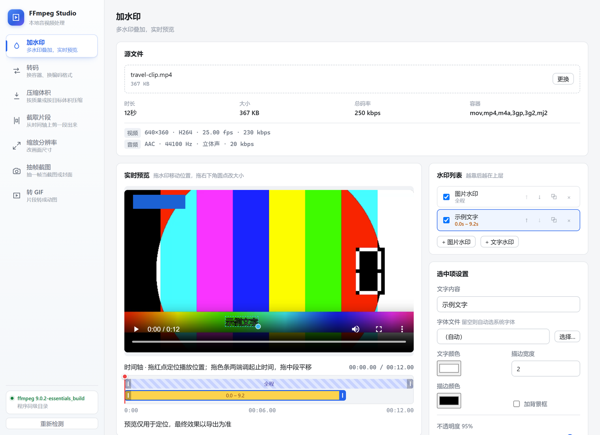
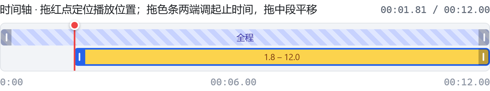
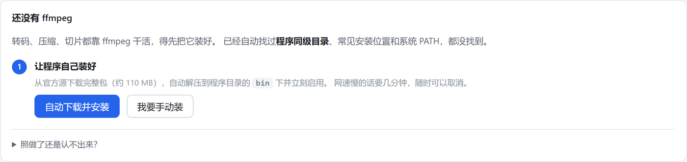

# FFmpeg Studio

把 ffmpeg 的命令行包成七个可视化操作页的本地小工具 —— 转码、压缩、截取、缩放、抽帧、转 GIF、加水印。
**全部在本机完成，不联网、不上传**；ffmpeg 第一次运行时可以一键自动装好。

用 **Go + Wails v2 + Vue 3** 写成，产出单个 11 MB 的 exe，双击即用。



## 功能

| 功能 | 说明 | 要点 |
|---|---|---|
| **转码** | 换容器、换编码格式 | 容器与编码器不兼容的组合会提前置灰，不用等到跑一半才炸 |
| **压缩体积** | 按质量（CRF）或按目标体积 | 目标体积走两遍编码，界面上把码率算式摊开给你看 |
| **截取片段** | 时间轴上拖选区间 | 快速模式不重编码（秒级），精确模式逐帧定位 |
| **缩放分辨率** | 预设或自定义尺寸 | 保持比例时自动取偶数，避免 h264 因奇数尺寸编码失败 |
| **抽帧截图** | 抽单帧 / 批量 / 设为封面 | 设为封面时写 `attached_pic` 流，视频不重编码 |
| **转 GIF** | 片段转动图 | 默认两遍法（先生成专属调色板），画质远好于直接转 |
| **加水印** | 图片 + 文字混合叠加，实时预览 | 拖拽定位、时间轴控制每个水印各自的显示区间 |

### 加水印

水印是叠在视频上的网页元素，拖动零延迟；导出时按同一套**相对坐标**（0~1）换算成 ffmpeg 表达式
`overlay=x='w*0.05'`，所以改输出分辨率位置也不会偏。

每个水印可以**各自设置自己的显示时间段**，互不影响：



- 拖**红色圆点**定位播放位置（按住可连续拖）
- 拖**色条两端手柄**调整出现 / 消失时间，拖中段整体平移
- 没设过时间段的显示为斜纹底的「全程」条，和已限定的实心条一眼区分
- 拖到片头片尾没有余地时会**说明原因**，而不是静默无反应

## 上手

### 直接运行

1. 从 [Releases](../../releases) 下载 `ffmpeg-studio.exe`
2. 双击运行。首次会提示缺少 ffmpeg，点「**自动下载并安装**」—— 它会把官方包下下来、
   解压到程序目录的 `bin` 下并自动启用（约 110 MB，有进度条，可随时取消）
3. 装好即用，无需其他依赖



> ffmpeg 不随包分发（官方完整版单个 exe 就有 212 MB），所以第一次要装一下。
> 网络受限时也可以点「我要手动装」，按提示下载后把文件夹丢到程序旁边即可 ——
> 程序会自动往下找两三层，带目录名也没关系。

### 从源码构建

前置：Go 1.22+、Node 18+、[Wails v2 CLI](https://wails.io/docs/gettingstarted/installation)

```bash
# 开发模式（前端热重载）
wails dev

# 构建单文件 exe
cd frontend && npm install && npm run build && cd ..
go build -tags production -ldflags "-H windowsgui -s -w" -o build/bin/ffmpeg-studio.exe .
```

> 注意：**必须先 `npm run build`**。后端用 `//go:embed all:frontend/dist` 嵌前端产物，
> 对着旧产物也能编译成功 —— 不报错，但界面不会更新。

## 架构

```
Vue 3 前端 ──(Wails 绑定)──> Go 后端
                              ├── internal/media     ffmpeg 定位 / 自动安装 / ffprobe / 媒体服务
                              ├── internal/task      任务模型 → ffmpeg 参数 → 执行 / 进度 / 取消
                              ├── internal/watermark 水印 → filter_complex
                              └── internal/proc      子进程创建（隐藏控制台窗口）
```

几个设计点：

- **参数构造是纯函数**（`Spec → []string`），不碰进程，所以能直接单元测试而不用真跑转码
- **预览走 Wails 的 HTTP 中间件**，支持 Range 请求，`<video>` 才能拖进度条
- **任务串行**：转码本来就吃满 CPU，并行只会互相拖慢
- ffmpeg 解不了的格式（HEVC 的 mkv 之类）会自动转一份 960px 的 h264 代理副本供预览，
  **导出始终用原始文件**

## 测试

```bash
go test ./...              # 后端 96 个用例（含真实调用 ffmpeg 的集成测试）
cd frontend && npm test    # 前端 26 个纯函数用例

bash tools/ui-verify/verify.sh   # UI 回归：真实浏览器 + 真实指针事件
```

除了常规单元 / 集成测试，有两层值得一提：

- **契约测试**：把前端实际发出的 JSON 钉进用例。前后端靠 JSON 传参，字段名对不上会**静默丢参数** ——
  界面看不出异常，只是结果不对
- **UI 回归验证**：拖拽、鼠标坐标这类交互光看代码判断不可靠（这个项目因此踩过三次坑）。
  `tools/ui-verify/` 会把前端跑起来、mock 掉后端绑定，用真实指针事件拖动并断言 DOM

详细实现与踩坑记录见 **[docs/DESIGN.md](docs/DESIGN.md)**。

## 已知限制

- **只在 Windows 上测过**。代码里有 macOS / Linux 分支（ffmpeg 探测路径、打开文件的命令），
  但没有实际验证
- ffmpeg 需要单独安装（首次运行可一键搞定）
- 水印预览用原片，格式浏览器解不了时等一次代理转码（只影响预览，不影响导出）

## License

[MIT](LICENSE)
